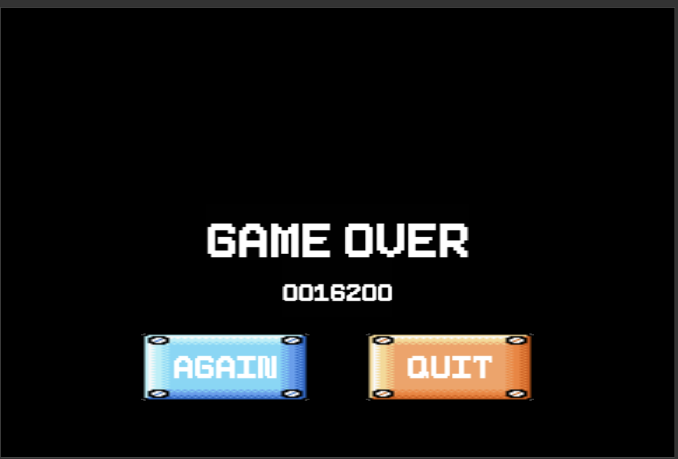

# Software Studio 2023 Spring Assignment 2

### Scoring

| **Basic Component** | **Score** | **Check** |
| :-----------------------: | :-------------: | :-------------: |
|   Membership Mechanism   |       10%       |        Y        |
|   Complete Game Process   |       5%       |        Y        |
|        Basic Rules        |       45%       |        Y        |
|        Animations        |       10%       |        Y        |
|       Sound Effects       |       10%       |        Y        |
|            UI            |       10%       |        Y        |

| **Advanced Component** | **Score** | **Check** |
| :--------------------------: | :-------------: | :-------------: |
|         Leaderboard         |       5%       |        N        |
|  Offline multi-player game  |       5%       |        N        |
|   Online multi-player game   |       15%       |        Y        |
|  Others [name of functions]  |      1-15%      |        Y        |

---

## Basic Components Description :

1. World map :

   * 關卡選擇地圖

     

     在這個地圖中玩家可以看到目前的狀態(分數、錢幣、生命)，左邊的水管會通向1-1，右邊的水管一開始不能進入，必須等到破關1-1後才能進入，想要進入哪一個關卡，就往該關卡方向的水管走即可。
   * 1-1地圖

     
   * 1-2地圖

     
   * 在1-1跟1-2中，相機都會隨著玩家移動。
2. Player :

   * 馬力歐使用左右鍵前進，空白鍵跳躍。
   * 當他碰到怪物但不是碰到怪物頭部時，若是小的狀態就會死亡，若是大的狀態就會變回小的，此外若馬力歐出界則不分大小直皆死亡。
   * 死亡後回到關卡選擇地圖，可以重新選擇要進入哪一關(若是在1-1死亡，馬力歐後會從1-1的水管出來)。
   * 每一次死亡生命會減一，若在生命危0時死亡就會進到GameOver頁面，決定要重來還是結束遊戲。

     
3. Enemies :

   * Goomba

     

     Goomba碰到障礙物會改變方向，若玩家從Goomba上方踩他就會讓他死亡，死亡會變成踩扁的模樣，且一段時間後會從地圖上消失。

     (這是被踩扁的樣子)
   * Turtle

     

     Turtle一樣碰到障礙物會改變方向，當玩家踩他的頭時，他會縮進龜殼裡，如果玩家再碰他一下就會開始旋轉並移動，且會對碰到的怪物跟玩家造成傷害。若縮進龜殼裡後玩家沒有碰他，一段時間後他就會從龜殼中出來，繼續正常的移動
4. Question Blocks :

   * 金幣

     

     玩家累積的金幣+1(集滿100可以加1條命)，分數+200
   * 蘑菇

     從箱子出來後會四處移動，玩家碰到之後可以從小變大，分數+1000
   * 玩家從Question Block下方撞擊時會使箱子中的物品浮現
5. Animations :

   * 玩家走路
   * 玩家跳
   * 玩家變大
   * Goomba移動
   * Turtle移動
   * Turtle旋轉
6. Sound effects :

   * 初始BGM
   * 遊玩BGM
   * 跳的音效
   * 死亡音效
   * 金幣音效
   * 蘑菇顯現音效
   * 玩家小變大音效
   * 玩家大變小音效
   * 水管音效
   * 重複吃蘑菇音效
7. UI :

   

   * 由左至右分別是分數、金幣、目前世界、計時器、生命

## Advanced Component Description :

1. 馬力歐變大

   * 當小馬力歐碰到蘑菇，他的體積跟外表都會改變

     
   * 大馬力歐碰到怪物時會變回小馬力歐，且會獲得一小段無敵時間
2. 密室視角

   * 在1-2中有一個特殊地點

     

     只要進入這裡就會觸發密室視角，只有馬力歐周遭是可視的

   

   離開密室就會回復原狀
3. 多人遊戲

   * 在登入後選擇2 player，選擇create會建立多人遊戲大廳，選擇join後輸入建立方的email就可以加入(一個大廳只能加入一個玩家
   * 雙方畫面的對方會有一點延遲，但最終的位置都會相同
   * 相機會跟著自己的角色移動
   * 當其中一方死亡，會在另外一方的上方復活，直到生命歸零為止，生命歸0後，相機會跟著另外一個玩家移動
   * 當兩個人同時死亡時就會回到關卡選擇畫面，雙方生命值歸零時會到GameOver(為了控制流量所以多人不能重來)。

   

   

# Firebase page link

    https://hw2-marioonline.web.app/
